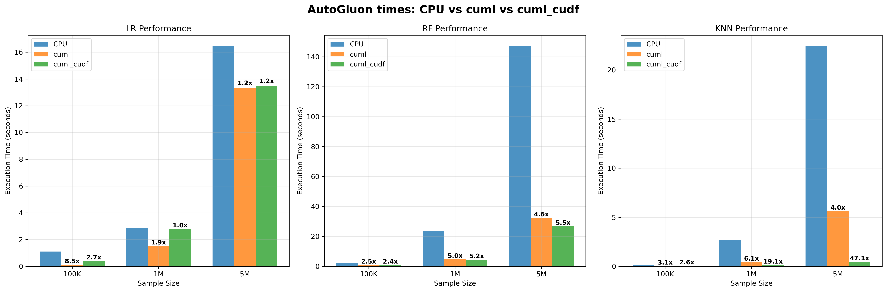
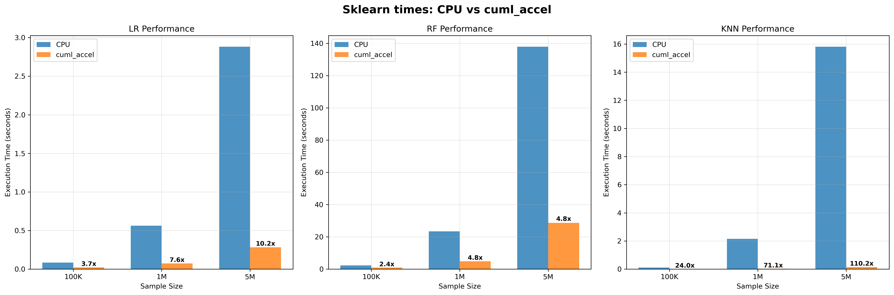

# Benchmark Analysis Report

## Methodology
- All reported values are **median of 5 runs**
- Speedup calculations: CPU_time / GPU_time
- Sample sizes: 100K, 1M, 5M data points
- **GPU runs:** we simply add `-m cuml.accel` to the script command. For the `cuml_cudf` case, also add `-m cudf.pandas`.

## Performance Comparison Plots

### AutoGluon Performance

### Sklearn Performance

## Tabular Results (Raw Data)
Below are the detailed benchmark results for each sample size and method. These tables present the raw median 
                            timing and accuracy values, as well as calculated speedups, for each model and implementation.

## Sample Size: 100K

### Sklearn Results:
| Model   |   CPU_Time |   cuml_accel_Time |   Speedup |
|:--------|-----------:|------------------:|----------:|
| lr      |     0.0837 |            0.0227 |    3.6872 |
| rf      |     2.2758 |            0.9489 |    2.3984 |
| knn     |     0.1057 |            0.0044 |   24.0227 |

### AutoGluon Results:
| Model         |   CPU_Time |   cuml_accel_Time |   Speedup_CPU_vs_cuml |   cuml_cudf_Time |   Speedup_CPU_vs_cuml_cudf |
|:--------------|-----------:|------------------:|----------------------:|-----------------:|---------------------------:|
| autogluon_lr  |     1.1107 |            0.1307 |                8.4981 |           0.4149 |                     2.677  |
| autogluon_rf  |     2.3005 |            0.9367 |                2.456  |           0.9517 |                     2.4173 |
| autogluon_knn |     0.1489 |            0.0478 |                3.1151 |           0.0582 |                     2.5584 |

### AutoGluon Accuracy Results:
| Model         |   CPU_Accuracy |   cuml_Accuracy |   cuml_cudf_Accuracy |
|:--------------|---------------:|----------------:|---------------------:|
| autogluon_lr  |         0.808  |          0.7812 |               0.7956 |
| autogluon_rf  |         0.9476 |          0.9392 |               0.9344 |
| autogluon_knn |         0.95   |          0.9512 |               0.9472 |

---

## Sample Size: 1M

### Sklearn Results:
| Model   |   CPU_Time |   cuml_accel_Time |   Speedup |
|:--------|-----------:|------------------:|----------:|
| lr      |     0.562  |            0.0738 |    7.6152 |
| rf      |    23.4172 |            4.8726 |    4.8059 |
| knn     |     2.1549 |            0.0303 |   71.1188 |

### AutoGluon Results:
| Model         |   CPU_Time |   cuml_accel_Time |   Speedup_CPU_vs_cuml |   cuml_cudf_Time |   Speedup_CPU_vs_cuml_cudf |
|:--------------|-----------:|------------------:|----------------------:|-----------------:|---------------------------:|
| autogluon_lr  |     2.8882 |            1.513  |                1.9089 |           2.7877 |                     1.0361 |
| autogluon_rf  |    23.396  |            4.7153 |                4.9617 |           4.5046 |                     5.1938 |
| autogluon_knn |     2.7155 |            0.4483 |                6.0573 |           0.1421 |                    19.1098 |

### AutoGluon Accuracy Results:
| Model         |   CPU_Accuracy |   cuml_Accuracy |   cuml_cudf_Accuracy |
|:--------------|---------------:|----------------:|---------------------:|
| autogluon_lr  |         0.8252 |          0.7506 |               0.7438 |
| autogluon_rf  |         0.961  |          0.9643 |               0.9666 |
| autogluon_knn |         0.9536 |          0.9391 |               0.9678 |

---

## Sample Size: 5M

### Sklearn Results:
| Model   |   CPU_Time |   cuml_accel_Time |   Speedup |
|:--------|-----------:|------------------:|----------:|
| lr      |     2.8822 |            0.2834 |   10.1701 |
| rf      |   137.993  |           28.7071 |    4.8069 |
| knn     |    15.809  |            0.1435 |  110.167  |

### AutoGluon Results:
| Model         |   CPU_Time |   cuml_accel_Time |   Speedup_CPU_vs_cuml |   cuml_cudf_Time |   Speedup_CPU_vs_cuml_cudf |
|:--------------|-----------:|------------------:|----------------------:|-----------------:|---------------------------:|
| autogluon_lr  |    16.447  |           13.3183 |                1.2349 |          13.4563 |                     1.2223 |
| autogluon_rf  |   147.07   |           32.2184 |                4.5648 |          26.7368 |                     5.5006 |
| autogluon_knn |    22.4143 |            5.5894 |                4.0101 |           0.4763 |                    47.0592 |

### AutoGluon Accuracy Results:
| Model         |   CPU_Accuracy |   cuml_Accuracy |   cuml_cudf_Accuracy |
|:--------------|---------------:|----------------:|---------------------:|
| autogluon_lr  |         0.8786 |          0.8405 |               0.7324 |
| autogluon_rf  |         0.965  |          0.9689 |               0.9686 |
| autogluon_knn |         0.958  |          0.9545 |               0.9629 |

---
